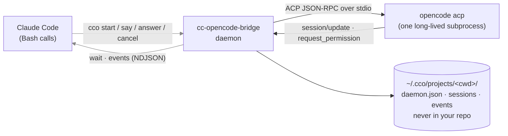
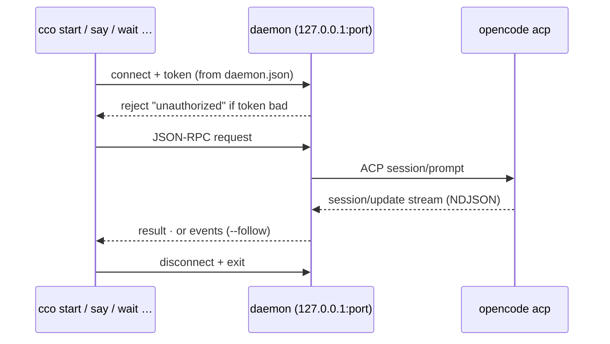
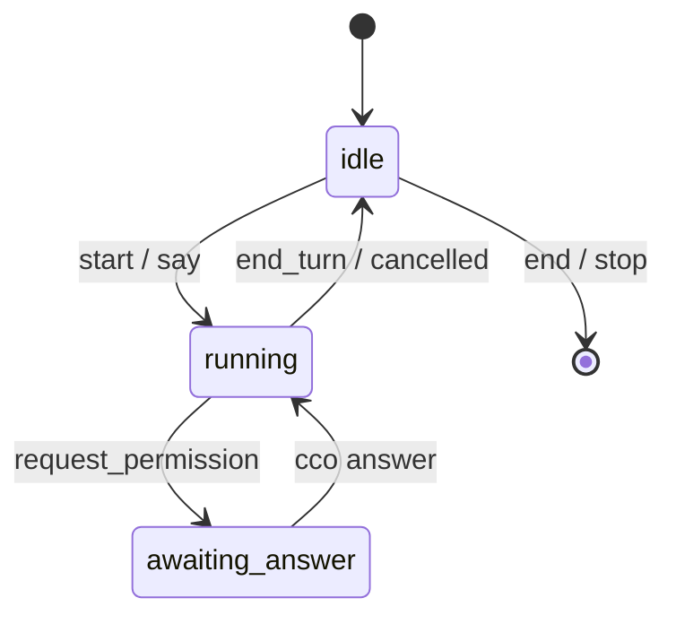

# cc-opencode-bridge

**ACP-native bidirectional bridge from Claude Code to opencode.** One long-lived daemon keeps opencode alive across unlimited turns. Claude Code sends tasks, follow-ups, and answers; opencode streams thoughts, tool calls, file edits, and questions back — all over the Agent Client Protocol, all in real time, with zero MCP.



> The Claude Code ↔ daemon channel is **loopback TCP** authenticated by a **per-daemon token** — see [Storage & security](#storage--security).

---

## What's different

| Feature | `opencode run` | `acpx` | `claw-orchestrator` | **`cc-opencode-bridge`** |
| --- | --- | --- | --- | --- |
| Bidirectional dialog | No | Partial | Yes (custom runtime) | **Yes (ACP-native)** |
| Session persistence | No | No | Yes | **Yes (resume across turns)** |
| Mid-task questions | No | No | N/A | **Yes (request_permission ↔ cco answer)** |
| Realtime event stream | No | Yes | Yes (dashboard) | **Yes (JSONL + cco events)** |
| Cancellation | Ctrl-C | Yes | Yes | **Yes (cco cancel → session/cancel)** |
| One process, many turns | No (spawn per call) | No | Yes | **Yes (daemon keeps opencode alive)** |
| Claude-Code-friendly | 7/10 | 6/10 | 4/10 | **10/10 (exit codes, JSON output)** |
| Transport | stdio (one-shot) | stdio | HTTP/WS | **ACP over stdio (spec-compliant)** |
| Official SDK | No | No | No | **Yes (@agentclientprotocol/sdk)** |

## Install

```bash
git clone https://github.com/SiddhantBohra/cc-opencode-bridge
cd cc-opencode-bridge
npm install
npm run build
npm link        # exposes `cco` globally
```

Prerequisites: Node 20+, [`opencode`](https://github.com/sst/opencode) v1.15+ on `PATH`.

---

## Quick start

### One-shot dispatch (no daemon)

```bash
cco dispatch "Add a /healthz endpoint" --cwd ./my-app
```

### Daemon mode (multi-turn, bidirectional)

```bash
# Terminal 1: start the daemon
cco serve --cwd ./my-app

# Terminal 2 (or from Claude Code via Bash):
SID=$(cco start "Refactor auth.ts to use bcrypt" --cwd ./my-app | jq -r .sessionId)
cco wait $SID --cwd ./my-app        # blocks until done or question
# exit 0 = done, 10 = question, 11 = cancelled

# Send a follow-up (reuses same session, same opencode process)
cco say $SID "Now write tests for it" --cwd ./my-app
cco wait $SID --cwd ./my-app

# Watch events live from another terminal
cco events $SID --follow --cwd ./my-app
```

### Answering questions from opencode

When opencode needs permission (e.g., to run a command), it pauses and asks. `cco wait` returns exit code `10` with the question details:

```bash
cco wait $SID --cwd ./my-app --quiet
# Output: {"reason":"question","sessionId":"ses_...","question":{"requestId":"q_42","title":"Run npm install?","options":[{"optionId":"allow_once","name":"Allow once","kind":"allow_once"},...]}}

# Answer it:
cco answer q_42 allow_once --cwd ./my-app

# Then wait for the turn to finish:
cco wait $SID --cwd ./my-app
```

---

## Watching opencode work

When you dispatch a task, `opencode acp` runs **headless** as a child of the daemon — there's no attached terminal, so by default you don't see it think or act. cco gives you four ways to watch it live, plus a browser dashboard.

### In the terminal

**1. Live progress while you wait — `cco wait --stream`**

The orchestration view: opencode's thoughts, tool calls, and file diffs render in real time as it works, then a machine-readable `---RESULT---` line. This is what makes a dispatch visible inside Claude Code's own output.

```bash
cco wait $SID --cwd ./my-app --stream      # add -v for raw tool inputs/outputs
# … live thoughts / tool calls / diffs stream here …
# done  context 9.6k/200.0k (5%)
# ---RESULT---
# {"reason":"end_turn","sessionId":"ses_…","lastMessage":"…"}
```

**2. Follow a session's event feed — `cco events --follow`**

Replays the session so far, then tails new events as a scrolling, rendered log. `--json` for the raw NDJSON.

```bash
cco events $SID --cwd ./my-app --follow
```

**3. Full-screen live view — `cco attach`**

Re-attach to a running session and watch it like the native opencode TUI: a fixed, in-place frame showing the current tool call, the streaming thought, and token usage. Press `q` to detach — the turn keeps running.

```bash
cco attach $SID --cwd ./my-app
```
```
┌─ ses_abc · turn 3 · running ───────────────────────────┐
│ 💭 thinking: need to add bcrypt hashing…               │
│ ▸ edit  src/auth.ts   ✓                                 │
│ $ bash  npm test      ⠹ running                         │
│ context: 12.4k / 200.0k tokens (6%)                    │
└──────────────────────── q to detach ───────────────────┘
```

**4. The whole fleet — `cco top`**

A live, `htop`-style table of **every** daemon and session across all your projects (state, token usage, current activity). `--once` prints a single snapshot (non-TTY safe).

```bash
cco top                # live, refreshing
cco top --once         # one snapshot, good for scripts
```
```
cco fleet — 2 daemons
  CWD                   SID         STATE      TOKENS         ACTIVITY
  my-app                pid 8092·acp 8094
      ses_15828…  running    —              edit src/auth.ts
  api-gateway           pid 8120·acp 8123
      ses_1582c…  awaiting   8.1k/200.0k    ? Run npm install?
```

> Want opencode's own stderr (startup errors, crashes)? `cco logs -f --cwd ./my-app`.

### In the browser — `cco serve --http`

Start the daemon with a web dashboard (bound to `127.0.0.1` only):

```bash
cco serve --cwd ./my-app --http 7777
# daemon: http dashboard on http://localhost:7777
```

Open <http://localhost:7777>: a session sidebar (state badges, polled live), a main pane that opens a **Server-Sent Events** stream for the selected session and renders the event feed as it arrives, and a header showing token usage. The same data is available as plain HTTP for your own tooling:

```bash
curl localhost:7777/api/sessions          # [{sessionId,status,turnCount}, …]
curl localhost:7777/api/snapshot/$SID     # current state + tool calls + tokens
curl -N localhost:7777/api/events/$SID    # SSE: history replay, then live
```

---

## Diagnostics

`cco doctor` is a one-shot environment health check — run it first when a dispatch won't start. It verifies the host (Node ≥ 20, the `opencode` binary — or `--agent <cmd>` — on `PATH` plus its version, and that `~/.cco` is writable) and then probes the whole fleet: for every daemon it checks the PID is alive and the port is reachable. It prints a `✓`/`⚠`/`✗` checklist and exits `0` when nothing failed, `1` otherwise.

```bash
cco doctor                       # check this host + the whole fleet
cco doctor --agent gemini        # check a different agent binary
cco doctor --json                # machine-readable report
```
```
cco doctor
  ✓ node            v22.19.0  (>= 20)
  ✓ opencode        on PATH · v1.16.2
  ✓ storage         ~/.cco writable
  ✓ daemon my-app       pid 8092 alive · port 51847 reachable
  ✗ daemon api-gateway  pid 8120 alive · port 51902 unreachable   [PORT_UNREACHABLE]
  ⚠ daemon legacy       pid 7740 not running (stale daemon.json)   [DAEMON_STALE]
```

Each failure carries a stable code from the error taxonomy:

| Code | Meaning |
| --- | --- |
| `NODE_TOO_OLD` | Node runtime is older than 20 |
| `BINARY_NOT_FOUND` | The opencode (or `--agent`) binary isn't on `PATH` |
| `VERSION_TOO_OLD` | The agent binary is present but below the required version |
| `STORAGE_UNWRITABLE` | `~/.cco` (or `CCO_HOME`) can't be written |
| `DAEMON_STALE` | `daemon.json` exists but its PID is dead |
| `PORT_UNREACHABLE` | Daemon PID is alive but its loopback port doesn't answer |
| `NO_DAEMON` | No daemon registered for this cwd |

---

## CLI reference

### Daemon lifecycle

| Command | Purpose |
| --- | --- |
| `cco serve [--cwd] [--agent] [--stderr] [--http [port]]` | Start the daemon (keeps opencode alive); `--http` adds a web dashboard |
| `cco stop [--cwd]` | Shut down the daemon |
| `cco status [--cwd] [--json]` | Show daemon info (incl. opencode child PID) + active sessions |
| `cco logs [--cwd] [-f] [-n lines]` | Tail the opencode child's stderr |
| `cco top [--once] [-i ms]` | Live dashboard of **all** daemons + their sessions |
| `cco doctor [--cwd] [--agent] [--json]` | Environment health check (Node, agent binary, `~/.cco`, fleet) |

### Session control

| Command | Purpose |
| --- | --- |
| `cco start <task> [--cwd]` | Create session, send first task, return `{sessionId}` |
| `cco say <sid> <text> [--cwd]` | Send follow-up to an idle session |
| `cco wait <sid> [--cwd] [-t ms] [-q] [-s] [-v]` | Block until turn ends/question/cancel/timeout; `-s` renders live progress |
| `cco attach <sid> [--cwd]` | Full-screen **live view** of a running session (`q` to detach) |
| `cco answer <reqid> <optionId> [--cwd]` | Answer a pending question |
| `cco cancel <sid> [--cwd]` | Cancel an in-progress turn |
| `cco end <sid> [--cwd]` | Close session, free resources |
| `cco events <sid> [--cwd] [-f] [-s seq] [--json]` | Stream/replay events |
| `cco sessions [--cwd] [--json]` | List all known sessions — works even when the daemon is down |

### Batch orchestration

| Command | Purpose |
| --- | --- |
| `cco graph <file> [-d cwd] [--auto-approve allow\|deny\|fail] [--no-auto-spawn] [--stop-spawned] [-t ms] [--json] [-q]` | Run a task dependency DAG: same cwd sequential, different cwds parallel |

### Legacy (one-shot, no daemon)

| Command | Purpose |
| --- | --- |
| `cco dispatch <task> [--cwd] [-r sid] [-q] [-v]` | Spawn opencode, run one turn, exit |
| `cco tail <path> [-f]` | Replay a JSONL log file |

### Exit codes for `cco wait`

| Code | Meaning |
| --- | --- |
| `0` | Turn completed (`end_turn`) |
| `10` | Question pending — answer with `cco answer` |
| `11` | Turn was cancelled |
| `12` | Error |
| `13` | Timeout |

---

## How Claude Code should use this

The intended orchestration pattern from Claude Code:

```bash
# Bootstrap (once per project)
cco serve --cwd /work &

# Dispatch a task
SID=$(cco start "Implement the auth module" --cwd /work | jq -r .sessionId)

# Wait loop: handle turns, questions, follow-ups
while true; do
  cco wait $SID --cwd /work --quiet > /tmp/wait.json 2>&1
  RC=$?

  if [ $RC -eq 0 ]; then
    # Turn complete — read events, summarize, done
    break
  elif [ $RC -eq 10 ]; then
    # Question from opencode
    REQID=$(jq -r .question.requestId /tmp/wait.json)
    TITLE=$(jq -r .question.title /tmp/wait.json)
    # Claude Code decides based on the question title
    cco answer $REQID allow_once --cwd /work
  elif [ $RC -eq 11 ]; then
    echo "Cancelled"
    break
  else
    echo "Error"
    break
  fi
done

# Send a follow-up in the same session
cco say $SID "Now add error handling" --cwd /work
cco wait $SID --cwd /work

# Cleanup
cco end $SID --cwd /work
cco stop --cwd /work
```

---

## Architecture

### Daemon mode

`cco serve` spawns one long-lived `opencode acp`, binds a loopback TCP port, and writes `~/.cco/projects/<encoded-cwd>/daemon.json` (`{port, token, …}`, mode `0600`). Every `cco` subcommand is a short-lived client that reads that file and authenticates:



Each session runs a per-session state machine:



### ACP client implementation

The daemon implements the full **client side** of the ACP protocol:

| ACP method | Bridge behavior |
| --- | --- |
| `session/update` | Record in session event log + stream to followers |
| `session/request_permission` | Surface as "question" event; block until `cco answer` resolves it |
| `fs/read_text_file` | Read from local filesystem |
| `fs/write_text_file` | Write to local filesystem (creates dirs) |
| `terminal/create` | Spawn real child process |
| `terminal/output` | Return buffered output + exit status |
| `terminal/wait_for_exit` | Block until process exits |
| `terminal/kill` / `release` | Signal and cleanup |

### Multi-agent fan-out

Everything is scoped per `--cwd` — the socket, the registry, the opencode process. Running multiple daemons in different directories gives you N truly parallel opencode instances, with the orchestrator (Claude Code) coordinating across them:

```bash
git worktree add .wt-taskA -b taskA && cco serve --cwd .wt-taskA &
git worktree add .wt-taskB -b taskB && cco serve --cwd .wt-taskB &
# dispatch independently, wait on both, merge results yourself
```

Don't ask one opencode session to multiplex parallel work: concurrent prompts on a single ACP connection are undefined behavior (opencode serializes turns through one global event stream per connection). One daemon = one turn at a time, by design. Sessions on a shared daemon isolate *context* (conversations never leak between sessionIds) but not *execution*. Separate processes buy true parallelism, crash isolation, and — with worktrees — file isolation.

### Batch graph mode

`cco graph <file>` turns the fan-out pattern above into a declarative file. A JSONC graph defines tasks with `dependsOn` chains; a task's prompt can interpolate an upstream task's final message via `{{taskId.result}}` (or `{{taskId.result:N}}` for the first *N* chars). It's a **client-side batch-runner** built on the same `start`/`wait`/`answer` primitives — Claude Code (or a human) authors the graph and reads the summary, so the orchestrator stays in charge; opencode never spawns sub-agents.

```jsonc
{
  "version": 1,
  "defaults": { "timeout": 300000, "autoApprove": "fail" },
  "tasks": [
    {
      "id": "analyze",
      "prompt": "Read src/cli.ts and list the 3 largest functions with line counts.",
      "cwd": "."
    },
    {
      "id": "plan",
      // {{analyze.result}} is replaced with analyze's final message before this prompt is sent.
      "prompt": "Given:\n{{analyze.result}}\nPropose a refactor for the largest one. <150 words.",
      "dependsOn": ["analyze"],
      "cwd": "."
    },
    {
      // Different cwd => its own daemon => runs in PARALLEL with the analyze→plan chain.
      "id": "docs",
      "prompt": "Summarize README.md in 5 bullet points.",
      "cwd": "../cc-ob-wt-docs",
      "autoApprove": ["Read", "Grep"]   // allowlist: only these prompts auto-approve
    },
    {
      "id": "report",
      // Fan-in: {{plan.result}} inlined whole, {{docs.result:500}} truncated to 500 chars.
      "prompt": "Combine into one markdown report.\n\n## Plan\n{{plan.result}}\n\n## Docs\n{{docs.result:500}}",
      "dependsOn": ["plan", "docs"]
    }
  ]
}
```

```bash
cco graph examples/graphs/analyze-refactor.jsonc --cwd /work
#   -d/--cwd <dir>            default cwd for tasks that omit one
#   --auto-approve <policy>   global allow|deny|fail (per-task autoApprove wins)
#   --no-auto-spawn           require pre-started daemons (don't `cco serve` per cwd)
#   --stop-spawned            stop only the daemons this run started
#   -t/--timeout <ms>   --json   -q/--quiet
```

**The parallelism rule is the cwd:** tasks sharing a cwd run **sequentially** (one daemon = one turn at a time); tasks on **different** cwds run in **parallel**, each on its own auto-spawned daemon — the documented worktree fan-out, now declarative. The runner walks the DAG in topological order, dispatching a task as soon as its dependencies finish.

Permission prompts during a task follow a per-task `autoApprove` policy that **defaults to `"fail"`**: an unattended batch never silently approves shell or file ops — the task fails and its dependents skip. Opt in per task (or globally via `--auto-approve`) with `"allow"`, `"deny"`, or a title-allowlist (`["Read", "Grep"]`) that auto-approves only matching prompts.

Progress streams as compact, per-lane lines (`✓` done · `▸` running · `⊘` skipped), with a `[lane]` tag grouping tasks by cwd:

```
[.]              ▸ analyze    running…
[../cc-ob-wt-docs] ▸ docs     running…       (parallel — different cwd)
[.]              ✓ analyze    done   12.4s
[.]              ▸ plan       running…
[../cc-ob-wt-docs] ✓ docs     done   9.1s
[.]              ✓ plan       done   15.0s
[.]              ✓ report     done   8.2s
graph: 4 done · 0 failed · 0 skipped
```

Exit codes: **1** = invalid graph (a `dependsOn` cycle or a `{{…}}` reference to an unknown task — caught before anything runs), **0** = every task done, **2** = at least one task failed or was skipped. Add `--json` for a machine-readable summary (per-task status, timing, and result text) that Claude Code can parse to decide what to do next.

### Key insight from opencode source

opencode's `acp` command stays alive until stdin closes (no idle timeout, no max-turn limit). One subprocess hosts unlimited sessions and turns indefinitely. The daemon keeps stdin open for the life of the process.

opencode's `session/prompt` **always resolves with `stopReason: "end_turn"`** — even when the turn is cancelled. On `session/cancel`, opencode 1.16+ aborts the active run but still resolves the pending prompt call cleanly with `end_turn` (older versions rejected it with a JSON-RPC error). So a cancelled turn is **indistinguishable from a completed one by stop reason alone**. The bridge handles both: when `cco cancel` fires, it flags the session `cancelled` before issuing `session/cancel`, then maps the resolved (or rejected) turn to `reason: "cancelled"` — so `cco wait` reports `cancelled` (exit 11) on every opencode version, not a false `end_turn`.

### Storage & security

All cco state lives under a single per-user root — **never in your project directory** — keyed per project by the encoded cwd, the same scheme Claude Code uses:

```
~/.cco/
  daemons.json                                 # global fleet index (cco top)
  projects/
    -Users-me-my-project/                      # one dir per project (cwd, / → -)
      daemon.json        # { pid, childPid, port, token, … }   (mode 0600)
      sessions.json      # session registry
      events-<sid>.jsonl # per-session event log
      daemon-stderr.log  # opencode child stderr
```

Override the root with the `CCO_HOME` env var. The daemon↔CLI channel is **loopback TCP** (`127.0.0.1`, ephemeral port) — no Unix socket, so no path-length limits and nothing in your repo. It's guarded by a **per-daemon token**: a 256-bit secret written to `daemon.json` (mode `0600`) that every CLI request must present (constant-time compared), so other local processes can't drive your daemon. The optional `--http` dashboard binds `127.0.0.1` only.

### Session persistence

Sessions are recorded in `~/.cco/projects/<cwd>/sessions.json` (id, first task, turn count, last message, timestamps). The registry survives daemon restarts — `cco sessions` lists past work even with the daemon down. Sending `cco say` to a session the daemon doesn't have in memory triggers an automatic ACP `session/resume`: opencode persists conversations server-side (its own SQLite store), so the full context (files discussed, decisions made) comes back, even days later in a fresh daemon.

```bash
cco sessions --cwd /work          # what was I working on?
cco say ses_abc123 "continue where we left off" --cwd /work   # auto-resumes
```

### Event log

Every session produces a JSONL event log at `~/.cco/projects/<cwd>/events-<sessionId>.jsonl`:

```jsonl
{"ts":"...","kind":"turn_start","data":{"turnCount":1,"prompt":"..."}}
{"ts":"...","kind":"session_update","data":{"sessionId":"...","update":{"sessionUpdate":"tool_call",...}}}
{"ts":"...","kind":"question","data":{"requestId":"q_5","title":"Run npm install?","options":[...]}}
{"ts":"...","kind":"answer","data":{"requestId":"q_5","optionId":"allow_once"}}
{"ts":"...","kind":"turn_end","data":{"stopReason":"end_turn"}}
{"ts":"...","kind":"turn_start","data":{"turnCount":2,"prompt":"Now add tests"}}
```

---

## Example

[`examples/password-generator/`](./examples/password-generator/) is a complete artifact of the e2e flow: opencode built a TypeScript CLI (with a 14-test suite) across a 3-turn session, including a human-in-the-loop language decision relayed through Claude Code. [`DEMO.md`](./examples/password-generator/DEMO.md) walks through the full transcript.

## Roadmap

Shipped:

- [x] **Watch opencode work** — `cco wait --stream`, `cco events --follow`, `cco attach` (full-screen live view), `cco top` (fleet dashboard), `cco logs`
- [x] **Web dashboard** via `cco serve --http` — SSE event stream + browser UI
- [x] **Token usage** surfaced live (context used / window · cost)
- [x] **Secure per-user state** — everything under `~/.cco`, loopback TCP + per-daemon token, nothing in your repo
- [x] **Task dependency graphs** — `cco graph` runs a declarative DAG (`{{taskId.result}}` interpolation, same-cwd sequential / cross-cwd parallel, `fail`-by-default approval policy)
- [x] **Diagnostics** — `cco doctor` health-checks Node, the agent binary, `~/.cco`, and the whole daemon fleet with a coded error taxonomy

Planned:

- [ ] `cco serve --detach` — daemonize without holding the terminal
- [ ] Auto-start daemon on first `cco start` if not running
- [ ] Council mode — parallel dispatches in isolated git worktrees with vote-based merge
- [ ] `session/set_mode` support — switch opencode between architect/code/ask modes
- [ ] Slash-command passthrough — `cco say $SID "/compact"` etc. over ACP `available_commands`
- [ ] Multi-agent — wrap Gemini CLI, Codex, and other ACP-compatible agents behind the same `cco` UX
- [ ] `_cco/*` extension methods — Claude Code→opencode sidechannel for mid-turn context injection

## License

MIT
